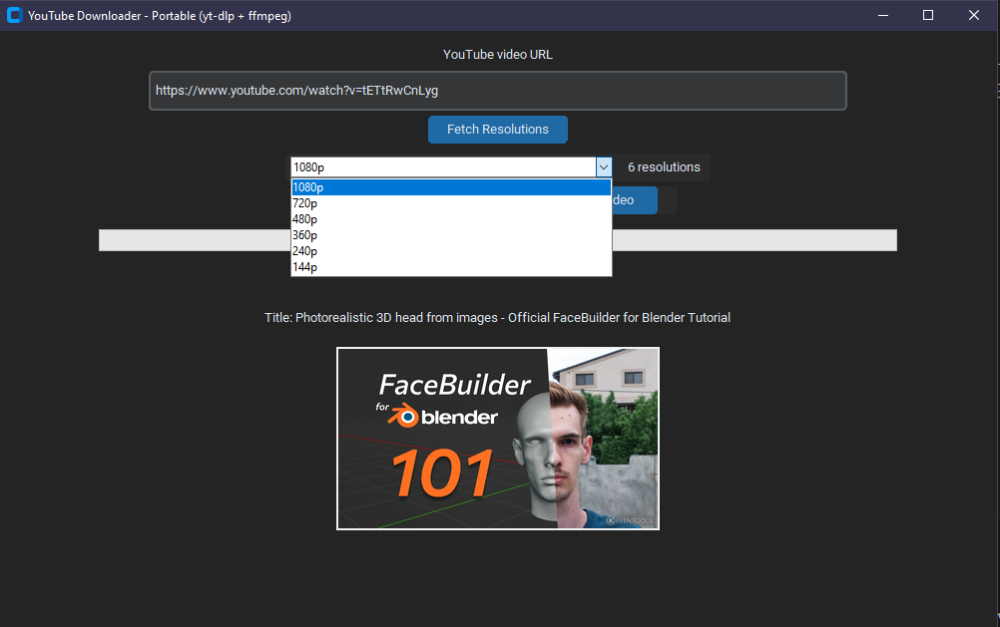
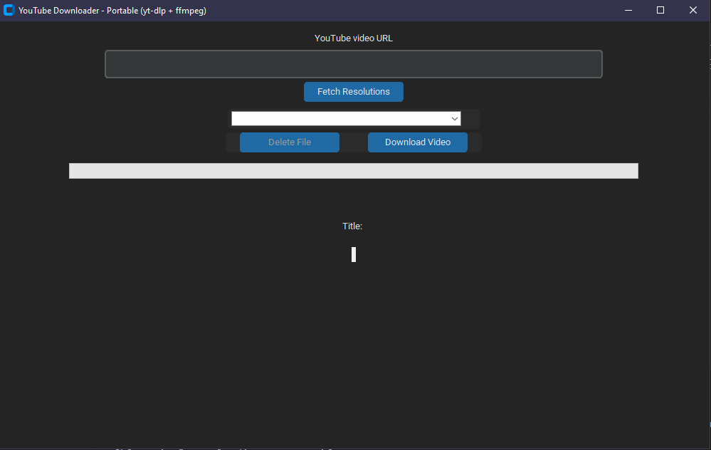

# 🎥 YouTubeDownloader (CustomTkinter + yt-dlp + FFmpeg)

A sleek, portable YouTube video downloader GUI built with `customtkinter`, `yt-dlp`, and `ffmpeg`.  
Supports high-resolution video+audio downloads with **progress tracking**, **auto filename**, **task log**, and **auto-filled URL from clipboard**.

---

## 🖼️ Interface Preview

| Thumbnail & Resolution Picker                 | Final Layout                              |
| --------------------------------------------- | ----------------------------------------- |
|  |  |

---

## 🚀 Features

- ✅ Fetch and display all available video resolutions
- ✅ Auto-fill URL from clipboard (YouTube links only)
- ✅ Auto-fill video title into filename (e.g. `MyVideo_1080p.mp4`)
- ✅ Download video+audio merged via FFmpeg (portable)
- ✅ Matrix-style task log panel with colored log levels
- ✅ Smooth progress bar (no double pass)
- ✅ Portable mode (FFmpeg embedded in `bin/` folder)
- ✅ Error handling with visible `[ERROR]` logs

---

## 📦 Requirements

- Python 3.8+
- `ffmpeg.exe` in `bin/` subfolder (auto-detected)
- Dependencies:
  ```bash
  pip install customtkinter yt-dlp pillow
  ```

---

## ▶️ How to Use

1. **Paste or copy** a YouTube video link (clipboard is monitored automatically).
2. Click **"Fetch Resolutions"**.
3. Choose a resolution from the dropdown.
4. Click **"Download Video"** — the filename will be auto-filled.
5. Monitor progress + task log in real-time.
6. (Optional) Click **Delete File** to remove the downloaded file.

---

## 📁 Folder Structure

```
YoutubeDownloader/
├── YoutubeDownloader.py
├── bin/
│   └── ffmpeg.exe
├── assets/
│   ├── screenshot_ui.png
│   ├── screenshot_log.png
│   └── screenshot_layout.png
└── README.md
```

---

## 🔧 Portable FFmpeg

To embed FFmpeg:

1. Download from: https://www.gyan.dev/ffmpeg/builds/
2. Extract `ffmpeg.exe` into the `bin/` folder next to `YoutubeDownloader.py`.

---

## ⚙️ Developer Notes

- Multiprocessing is used for downloads (avoids blocking UI).
- Progress is reported via shared variables + queues.
- GUI is statically laid out (no scrollbars, no dynamic resize).
- Clean shutdown and task cleanup are built-in.

---

## 🧠 Tip

- You can drag & drop the script into a PyInstaller packer if you want a standalone `.exe`.

---

## 📃 License

Info Prog, Saša Meden — use freely with attribution.
